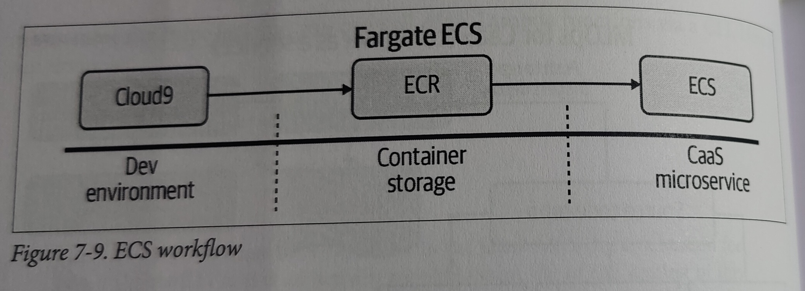

- Elastic Container Service
    - setup app: virtualenv + make all
    - test app local: python app.py
    - curl it to test: curl localhost:8080/change/1/34
    - create ECR Repo: https://www.freecodecamp.org/news/build-and-push-docker-images-to-aws-ecr/
    - build container: docker build -t changemachineimage .
    - push container
        - docker tag changemachineimage:latest XXXXXXXXXX.dkr.ecr.us-east-1.amazonaws.com/changemachine   
        - docker push XXXXXXXXXX.dkr.ecr.us-east-1.amazonaws.com/changemachine   
    - Deploy to Fargate
    - Test the public service

    